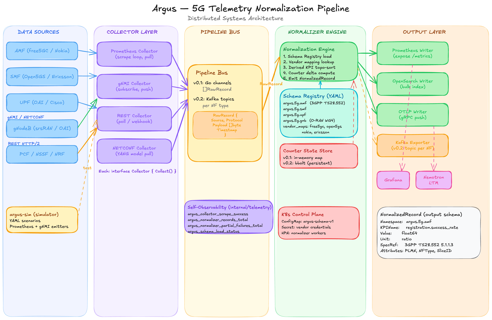

[](https://github.com/argus-telemetry/argus/actions/workflows/ci.yml)
[](https://github.com/argus-telemetry/argus/actions/workflows/e2e.yml)
[](CONTRIBUTING.md)

> CNCF Sandbox application in progress

# Argus

**Kubernetes-native 5G telemetry normalization pipeline.** Maps heterogeneous vendor metrics (Nokia, Ericsson, free5GC, Open5GS) to 3GPP TS 28.552 canonical KPIs via an openly-editable schema registry. Exports via Prometheus and OTLP. OTel 5G semantic conventions for CNCF.

## Problem

Every 5G vendor exposes different metric names, label conventions, and counter semantics. A `free5gc_nas_msg_received_total{name="RegistrationRequest"}` in free5GC is `open5gs_amf_registration_total{status="attempted"}` in Open5GS. Operators running multi-vendor deployments end up maintaining per-vendor dashboards, per-vendor alerting rules, and per-vendor SLA computation logic -- all representing the same 3GPP-defined KPIs.

Argus eliminates this by sitting between your NFs and your observability stack. It scrapes vendor-native telemetry, maps it through a declarative schema grounded in 3GPP specs, computes derived KPIs (success rates, loss ratios), and exposes a unified Prometheus endpoint.

## Documentation

| Guide | Description |
|-------|-------------|
| [Quickstart](docs/operator-guide/quickstart.md) | Docker Compose: zero to dashboard in 5 commands |
| [Certification](docs/operator-guide/certification.md) | argus-certify CLI -- validate your deployment |
| [Vendor Connectors](docs/operator-guide/vendor-connectors.md) | Add a new vendor to the schema registry |
| [Production Deployment](docs/operator-guide/production-deployment.md) | Helm, Redis, multi-worker, HPA, monitoring |
| [Counter Store Evolution](docs/architecture/counter-store-evolution.md) | Redis+WAL design and upgrade path |
| [Roadmap](docs/roadmap.md) | Release history and planned milestones |

## Community

| Document | Description |
|----------|-------------|
| [Governance](GOVERNANCE.md) | Roles, decision making, conflict resolution |
| [Contributing](CONTRIBUTING.md) | DCO, PR process, development setup |
| [Code of Conduct](CODE_OF_CONDUCT.md) | CNCF Code of Conduct |
| [Security](SECURITY.md) | Vulnerability reporting and disclosure policy |
| [Adopters](ADOPTERS.md) | Organizations using Argus |
| [Roadmap](docs/roadmap.md) | Release history and future plans |

## argus-certify

Validate that your Argus deployment produces correct KPIs:

```bash
# Run all certification scenarios
argus-certify matrix --scenarios test/scenarios/matrix/

# Run a single scenario
argus-certify run --scenario test/scenarios/matrix/free5gc_steady_state.yaml

# List available scenarios
argus-certify list-scenarios --dir test/scenarios/matrix/
```

See [Certification Guide](docs/operator-guide/certification.md) for writing custom scenarios and CI integration.

## Architecture



## Quickstart

Spin up the full stack -- simulator, Redis, Argus, Prometheus, Grafana -- in one command:

```bash
cd examples/quickstart
docker compose up --build -d
```

Open Grafana at [http://localhost:3000](http://localhost:3000) (anonymous access enabled). The pre-provisioned **Argus 5G NOC** dashboard shows registration success rates, connected UEs, PDU sessions, UL/DL throughput, and collector health.

Scrape Argus directly:

```bash
curl -s localhost:8080/metrics | grep argus_5g
```

Tear down:

```bash
docker compose down
```

## free5GC Integration

Run Argus against a real free5GC v4.2.0 core with UERANSIM generating traffic:

```bash
cd examples/free5gc
docker compose up --build -d
```

After the core is up (~15s), provision the test subscriber:

```bash
./init-subscriber.sh
```

UERANSIM will register a UE and establish a PDU session. Argus scrapes the AMF's Prometheus endpoint (port 9091) and normalizes the metrics.

| Service | URL |
|---------|-----|
| Argus metrics | [http://localhost:8080/metrics](http://localhost:8080/metrics) |
| Grafana | [http://localhost:3000](http://localhost:3000) |
| Prometheus | [http://localhost:9093](http://localhost:9093) |
| free5GC WebUI | [http://localhost:5001](http://localhost:5001) (admin/free5gc) |

**Note:** The UPF requires the `gtp5g` kernel module for data plane forwarding. Control plane metrics (registration, handover, PDU session) work regardless. free5GC v4.2.0 only exposes AMF-side business metrics -- SMF and UPF have no Prometheus instrumentation.

## Configuration

Argus reads a YAML config file (default: `argus.yaml`):

```yaml
schema_dir: schema/v1

store:
  type: redis          # memory | bbolt | redis
  redis:
    addr: "redis:6379"
    key_ttl: 120s

normalizer:
  worker_count: 4      # set to num(CPU) for production
  queue_depth: 256

collectors:
  - name: free5gc-amf
    endpoint: http://amf:9091
    interval: 15s

output:
  prometheus:
    listen: ":8080"
```

### Collector Names

| Name | Protocol | NF Type |
|------|----------|---------|
| `free5gc-amf` | Prometheus | AMF |
| `free5gc-smf` | Prometheus | SMF |
| `free5gc-upf` | Prometheus | UPF |
| `open5gs-amf` | Prometheus | AMF |
| `open5gs-smf` | Prometheus | SMF |
| `open5gs-upf` | Prometheus | UPF |
| `gnmi-gnb` | gNMI | gNodeB |

The gNMI collector requires additional config in the `extra` block:

```yaml
- name: gnmi-gnb
  endpoint: gnb:9339
  interval: 10s
  extra:
    gnmi_paths:
      - /gnb/cell/prb/utilization
      - /gnb/cell/throughput/downlink
    sample_interval: "5s"  # optional, defaults to interval
```

## Schema

Schemas live in `schema/v1/` as YAML files -- one per NF type (AMF, SMF, UPF, gNB, Slice). Each schema defines:

- **KPIs**: normalized metric names, units, 3GPP spec references
- **Derived KPIs**: formulas computing success rates and ratios from base KPIs
- **Vendor mappings**: how each vendor's raw metrics map to the unified KPIs

Example mapping (AMF registration success rate):

```yaml
# schema/v1/amf.yaml
kpis:
  - name: registration.success_rate
    unit: ratio
    spec_ref: "3GPP TS 28.552 S5.1.1.3"
    derived: true
    formula: >-
      registration.attempt_count > 0
      ? (registration.attempt_count - registration.failure_count)
        / registration.attempt_count
      : 0
    depends_on:
      - registration.attempt_count
      - registration.failure_count

mappings:
  free5gc:
    metrics:
      registration.attempt_count:
        prometheus_metric: free5gc_nas_msg_received_total
        labels: {name: RegistrationRequest}
        type: counter
        label_match_strategy: sum_by
```

Full schema reference: [`schema/v1/`](schema/v1/)

### Vendor Connectors

Community-contributed vendor connectors live in [`docs/vendor-connectors/`](docs/vendor-connectors/). See the [Vendor Connectors Guide](docs/operator-guide/vendor-connectors.md) for how to add your vendor.

## Simulator

`argus-sim` generates protocol-identical telemetry for testing without real NFs:

```bash
go run ./cmd/argus-sim --scenario simulator/scenarios/steady_state.yaml
```

Available scenarios:

| Scenario | Description |
|----------|-------------|
| `steady_state.yaml` | Healthy 5G core -- all KPIs nominal |
| `alarm_storm.yaml` | Registration storm + UE drop on AMF |
| `slice_sla_breach.yaml` | PDU session spike + UE connectivity drop |

## Building

```bash
# Build both binaries
make build

# Run tests
make test

# Integration tests
make integration

# Certification matrix
make matrix

# Helm lint
make helm-lint

# Full CI gate
make check && make helm-lint && make matrix
```

## License

Apache 2.0
